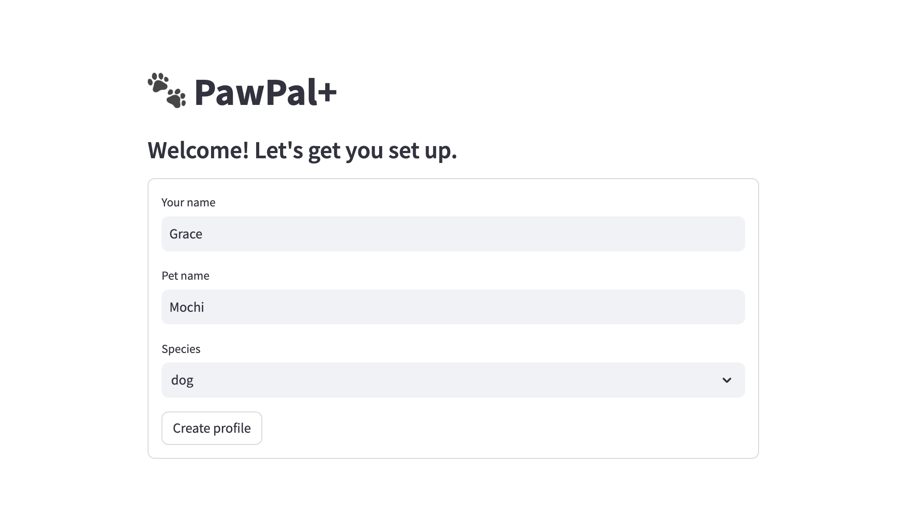
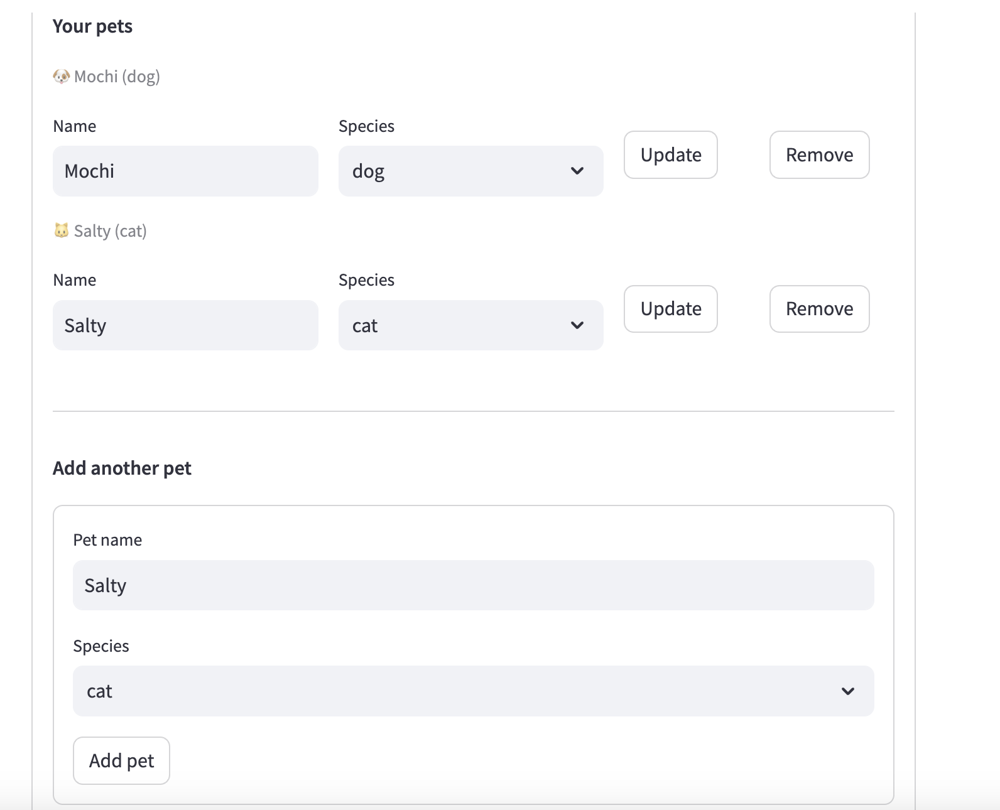
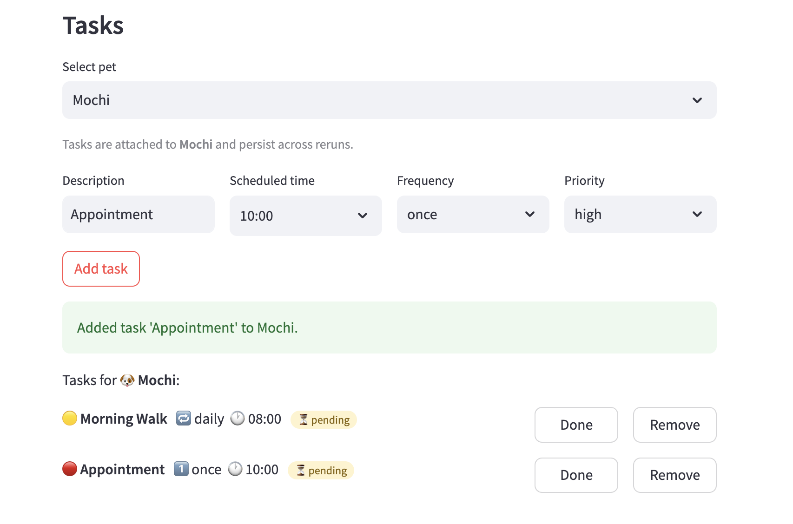
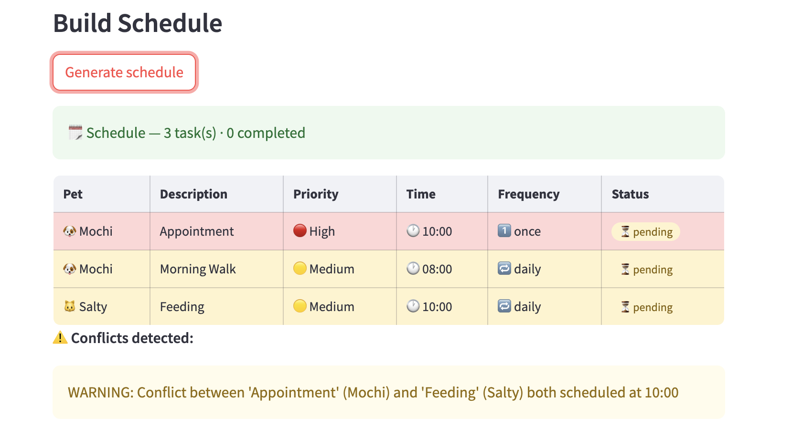

# PawPal+ (Module 2 Project)

**PawPal+** is a Streamlit web app that helps busy pet owners plan and track daily care tasks for their pets. After a quick setup (owner name + first pet), users can add timed tasks (walks, feeding, meds, grooming, etc.) with a priority and recurrence frequency. A single click generates a prioritized daily schedule — high-priority tasks first, then by scheduled time — and flags any time conflicts inline. Recurring tasks (daily or weekly) automatically reappear the next day or week once marked complete, so nothing falls through the cracks.

## Scenario

A busy pet owner needs help staying consistent with pet care. They want an assistant that can:

- Track pet care tasks (walks, feeding, meds, enrichment, grooming, etc.)
- Consider constraints (time available, priority, owner preferences)
- Produce a daily plan and explain why it chose that plan

Your job is to design the system first (UML), then implement the logic in Python, then connect it to the Streamlit UI.

## What you will build

Your final app should:

- Let a user enter basic owner + pet info
- Let a user add/edit tasks (duration + priority at minimum)
- Generate a daily schedule/plan based on constraints and priorities
- Display the plan clearly (and ideally explain the reasoning)
- Include tests for the most important scheduling behaviors

## Features

- **Priority-first scheduling** — `build_schedule()` sorts today's pending tasks by priority (high → medium → low), then by scheduled time within each priority tier. Tasks with no time set are placed at the end.
- **Sorting by time** — `sort_by_time()` returns all tasks across every pet ordered by clock time, earliest first, with unscheduled tasks appended at the end.
- **Conflict warnings** — `detect_conflicts()` performs a pairwise scan of the schedule and emits a human-readable warning for every pair of tasks whose scheduled times are identical. Displayed inline in the UI as ⚠️ alerts.
- **Daily recurrence** — when a `daily` task is marked complete, `mark_task_complete()` automatically creates a new pending copy of that task scheduled for the next day (`timedelta(days=1)`).
- **Weekly recurrence** — same mechanism for `weekly` tasks; the next occurrence is set to `timedelta(days=7)` from today.
- **Filtering by status** — `filter_by_status()` returns only the (pet, task) pairs whose status matches a given value (`"pending"`, `"completed"`, or `"skipped"`).
- **Filtering by pet** — `filter_by_pet_name()` returns all tasks belonging to a named pet, using case-insensitive matching.
- **Due-date gating** — `Task.is_due()` ensures only tasks whose date is today or earlier surface in the daily schedule, keeping future tasks out of today's view.

## Testing PawPal+

Run the full test suite from the project root:

```bash
python -m pytest tests/test_pawpal.py -v
```

The tests cover three core scheduling behaviors:

| Area | What is tested |
|---|---|
| **Sorting correctness** | `sort_by_time()` returns tasks in chronological order (earliest first); tasks with no scheduled time are always placed last. |
| **Recurrence logic** | Marking a `daily` task complete via `mark_task_complete()` automatically adds a new `pending` copy of that task scheduled for the following day. One-off (`once`) tasks produce no follow-up. |
| **Conflict detection** | `detect_conflicts()` emits a warning for every pair of tasks sharing an identical scheduled time; returns an empty list when all times differ or when tasks have no time set. |

Confidence level on system reliablility: 4 stars

## Getting started

### Setup

```bash
python -m venv .venv
source .venv/bin/activate  # Windows: .venv\Scripts\activate
pip install -r requirements.txt
```

### Run the app

```bash
streamlit run app.py
```

Streamlit will open the app automatically in your browser at `http://localhost:8501`.

### Suggested workflow

1. Read the scenario carefully and identify requirements and edge cases.
2. Draft a UML diagram (classes, attributes, methods, relationships).
3. Convert UML into Python class stubs (no logic yet).
4. Implement scheduling logic in small increments.
5. Add tests to verify key behaviors.
6. Connect your logic to the Streamlit UI in `app.py`.
7. Refine UML so it matches what you actually built.

### 📸 Demo




